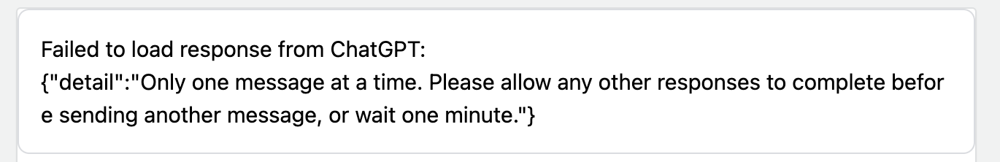

# ChatGPT Knowledge

---

A browser extension to display ChatGPT response to questions from Q&A platforms such as stackoverflow, quora
* [Quora](https://www.quora.com/)
* [Yahoo知恵袋](https://chiebukuro.yahoo.co.jp/)
* [知乎](https://www.zhihu.com/)
* [stackoverflow](https://stackoverflow.com/)

[Install from Chrome Web Store](https://chrome.google.com/webstore/detail/chatgpt-knowledge/chdldcpcjochbemlaclnckfkeaojibao)

## Screenshot

## Features

- Supports the official OpenAI API
- Markdown rendering
- Code highlights
- Provide feedback to improve ChatGPT
- Copy to clipboard
- Custom trigger mode

## TODOs

- [x] add zhihu support
- [x] add stackoverflow support

## Troubleshooting

### Fail to load response from ChatGPT

* Wait for a minute and retry
* Or switch to manual mode

## Build from source

1. Clone the repo
2. Install dependencies with `npm`
3. `npm run build`
4. Load `build/chromium/` or `build/firefox/` directory to your browser

## Acknowledgement

* https://github.com/wong2/chatgpt-google-extension